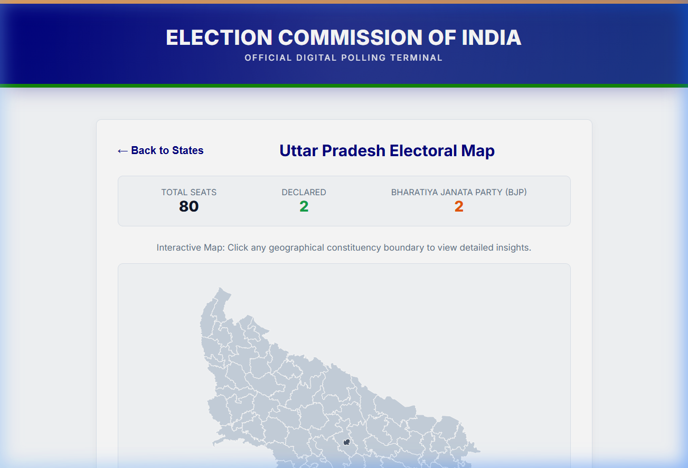
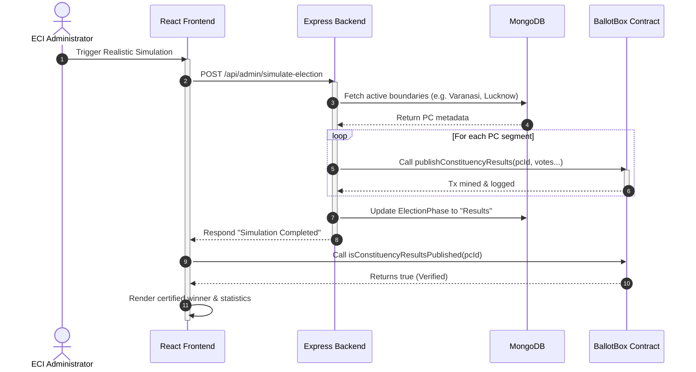

# 🗳️ Indian E-Voting & Blockchain Simulation Portal

<div align="center">

[](https://soliditylang.org/)
[](https://react.dev/)
[](https://nodejs.org/)
[](https://www.mongodb.com/)
[](https://hardhat.org/)
[](https://opensource.org/licenses/MIT)

*A secure, decentralized, constituency-aware digital polling and audit dashboard representing a modern administrative framework for the Election Commission of India (ECI).*

</div>

---

## 📸 Portal Interface

Here is the live rendering of the **Uttar Pradesh Electoral Map** following an automated smart-contract verified simulation run, showing real-time constituency results directly queried from the Ethereum blockchain:

<div align="center">
  
</div>

---

## ⚡ System Architecture & Data Flow

The portal maps state and constituency boundary records in MongoDB directly to an on-chain smart contract ledger, keeping web clients reactive via real-time transaction tracking.



---

## 📂 Project Structure

```
📂 indian-e-voting/
├── 📂 backend/               # Node Express API & Seeding Framework
│   ├── 📂 config/            # Electoral roll & Disqualified lists
│   ├── 📂 controllers/       # Geographical query controllers
│   ├── 📂 models/            # Mongoose Schemas (Boundaries, Phases)
│   ├── 📂 routes/            # Admin & Public voting endpoints
│   ├── 📂 scripts/           # Seeding scripts (MongoDB & Blockchain)
│   └── 📄 server.js          # Server entrypoint
│
├── 📂 blockchain/            # Solidity Smart Contracts & Hardhat
│   ├── 📂 contracts/         # BallotBox.sol (Consensus ledger)
│   ├── 📂 scripts/           # Deployment scripts targeting Localhost
│   └── 📄 hardhat.config.js  # Network configs & compiler optimization
│
├── 📂 frontend/              # Vite React Client
│   ├── 📂 src/
│   │   ├── 📂 components/    # EciControlVault, ResultsDashboard, Maps
│   │   ├── 📄 App.jsx        # Routing configuration
│   │   └── 📄 index.css      # Core HSL color palettes & styles
│   └── 📄 vite.config.js     # Dev server & port configurations
│
└── 📄 README.md              # Project Documentation
```

---

## 🛠️ Technology Stack

- **Client:** React 18 (SPA), React Router, HSL tailored CSS, Tailwind CSS.
- **Server:** Node.js, Express.js (REST APIs), Mongoose.
- **Consensus:** Solidity `^0.8.19`, Ethers.js v6, Hardhat v3.

---

## 🚀 Installation & Local Setup

### Prerequisites
- Node.js (v18+)
- MongoDB (running locally on port `27017`)

### 1. Hardhat Node (Blockchain)
Initialize and start the local JSON-RPC Ethereum node:
```bash
cd blockchain
npm install
npx hardhat node
```

### 2. Contract Deployment
Deploy the BallotBox contract onto the running localhost network:
```bash
cd blockchain
npx hardhat run scripts/deploy.js --network localhost
```
*Take note of the success address (e.g. `0x5FbDB2315678afecb367f032d93F642f64180aa3`) and verify it matches the `VOTING_CONTRACT_ADDRESS` in your backend `.env`.*

### 3. Backend Setup & Seeding
Configure environment variables and populate MongoDB and the smart contract:
```bash
cd backend
npm install
# Verify/create backend/.env file:
# PORT=5000
# MONGO_URI=mongodb://localhost:27017/indian-e-voting
# VOTING_CONTRACT_ADDRESS=0x5FbDB2315678afecb367f032d93F642f64180aa3
# BLOCKCHAIN_PROVIDER_URL=http://127.0.0.1:8545
# ADMIN_SECRET_PASSPHRASE="password123"

# Seed geographic boundaries & initial on-chain candidate states
npm run seed:india       # Populates MongoDB boundaries
npm run seed:blockchain  # Populates on-chain constituencies
npm run seed:parties     # Registers the 11 national political parties on-chain

# Start the Express API server
npm start
```

### 4. Frontend Setup
Start the local hot-reloaded dev server:
```bash
cd frontend
npm install
npm run dev
```
Open `http://localhost:3000/` in your browser.

---

## 🧪 Simulation Lifecycle

1. Navigate to the **ECI Department Control Vault** at `/eci-department-control`.
2. Authenticate using the passphrase: `password123`.
3. Click the **Tester (All) quick demo** shortcut to gain full zone authorization.
4. Click **Run Realistic Election Simulation** to begin a non-blocking background transaction pipeline.
5. Track progress via the dynamic UI progress bar (`0% ➔ 100%`).
6. Once completed, results are automatically published and signed on the blockchain, updating the home map dashboard instantly.
